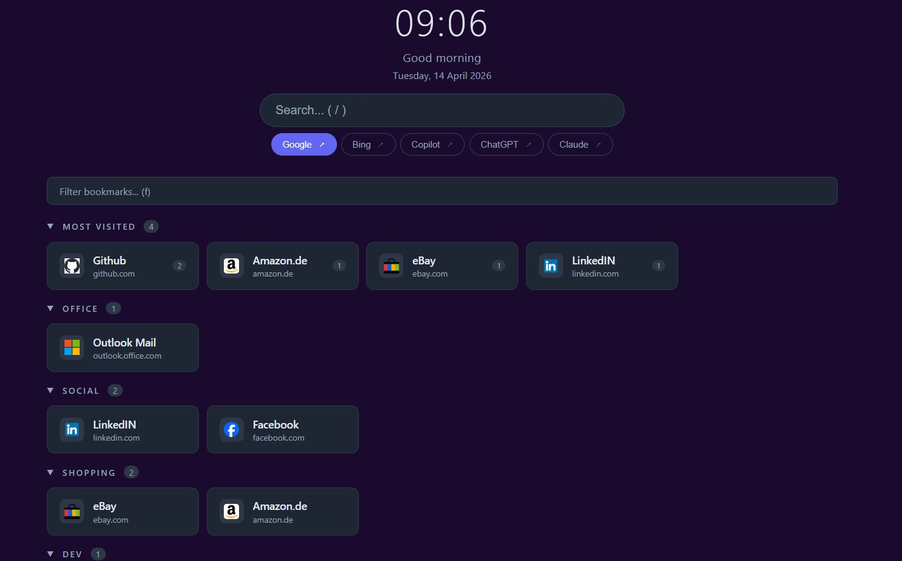

# StartPage

A minimalist, single-file browser start page powered by the [Raindrop.io](https://raindrop.io) API. No build step, no dependencies — just one `index.html` file you set as your browser's home page.

**Live demo:** [kilsgaard.github.io/StartPage](https://kilsgaard.github.io/StartPage/)



---

## Features

- **Live clock & date** — updates every second, supports DA/EN locales
- **Search bar** — supports Google, Bing, Copilot, ChatGPT, and Claude; switch engines with keyboard shortcuts `1`–`9` or drag to reorder
- **Raindrop.io integration** — loads your bookmarks from a named Raindrop collection and renders them as grouped, collapsible sections
- **Most visited** — automatically surfaces your most-clicked links at the top
- **Pinned shortcuts** — up to two quick-access links always visible above your bookmarks
- **Keyboard shortcuts** — press `?` to see all available shortcuts:
  - `/` — focus search
  - `f` — filter bookmarks
  - `Esc` — close/clear
  - `1`–`9` — switch search engine
- **DA / EN language toggle** — switch the interface language in Settings
- **Fully customizable appearance:**
  - Background color (presets + custom color picker)
  - Background image (URL or local file upload)
  - Font family (system + 7 Google Fonts)
  - Primary and secondary text colors
- **Collapsible sections** — collapse/expand bookmark groups; state is remembered
- **Frosted glass effect** — cards adapt automatically when a background image is set
- **No tracking, no server** — everything runs in the browser; settings are stored in `localStorage`

---

## Getting Started

### 1. Get a Raindrop.io API token

1. Go to [Raindrop.io App Settings → Integrations](https://app.raindrop.io/settings/integrations)
2. Create a new app (or use an existing one)
3. Copy the **Test token** — this is your API token

### 2. Set up your Raindrop collection

Create a collection in Raindrop.io called **StartPage** (or any name you prefer). Inside it, create sub-collections — each one becomes a section on the page.

```
StartPage/
├── Work
├── Dev Tools
├── Reading
└── Social
```

### 3. Install the start page

**Option A — local file (simplest)**

1. Download [`index.html`](index.html) and [`favicon.svg`](favicon.svg) to a folder on your computer
2. Open `index.html` in your browser
3. Set the local file path as your browser's home page

**Option B — host it yourself**

Upload the two files to any static web host (GitHub Pages, Netlify, your own server, etc.) and set the URL as your home page.

**Option C — use it as your New Tab page (Edge)**

Since browsers don't natively allow custom New Tab pages from local files, you can use a browser extension. The [New Tab Changer](https://microsoftedge.microsoft.com/addons/detail/new-tab-changer/dlbnebcbaeajdpekcdhmcgdhoodcjpeg) extension for Microsoft Edge lets you point your New Tab to any URL — including a locally hosted or GitHub Pages-hosted version of this page.

### 4. Configure

When you first open the page, the Settings panel opens automatically. Enter your API token and collection name, then click **Save and load**.

You can reopen Settings at any time via the **⚙ Settings** button (top right) or by clicking the gear icon.

---

## Settings

| Setting | Description |
|---|---|
| API Token | Your Raindrop.io personal test token |
| Collection name | The name of your top-level Raindrop collection (default: `StartPage`) |
| Shortcut 1 / 2 | Quick-access pinned links shown above bookmarks |
| Background color | Choose from presets or pick a custom color |
| Background image | Paste a URL or upload a local image file |
| Font | System font or one of 7 Google Fonts |
| Text colors | Primary (headings/links) and secondary (domains/dates) |
| Most visited | Number of top-clicked links shown in the "Most visited" section |
| Language | Interface language: Danish (DA) or English (EN) |
| Hidden sections | Bookmark sections that are hidden from the main view |

---

## Keyboard Shortcuts

| Key | Action |
|---|---|
| `/` | Focus the search bar |
| `f` | Filter/search bookmarks |
| `Esc` | Close overlay / clear input |
| `1`–`9` | Switch to search engine #N |
| `?` | Open keyboard shortcut reference |

---

## Search Engines

| Engine | Behavior |
|---|---|
| Google | Standard URL search |
| Bing | Standard URL search |
| Copilot | Copies query to clipboard, opens Copilot |
| ChatGPT | Copies query to clipboard, opens ChatGPT |
| Claude | Copies query to clipboard, opens Claude |

AI engines copy your query to the clipboard so you can paste it directly into the chat. A toast notification confirms the copy.

---

## Tech

- **Pure HTML/CSS/JS** — zero build tooling, zero npm, zero frameworks
- **Raindrop.io REST API v1** — collections and raindrops fetched client-side
- **Google Fonts API** — loaded on demand based on your font selection
- **Google Favicons** — `s2/favicons` endpoint provides bookmark icons
- **`localStorage`** — all settings and click counts are stored locally in the browser

---

## Privacy

All data stays in your browser. The page makes two external requests:

1. The Raindrop.io API (using your token) to fetch your bookmarks
2. Google's favicon service to load bookmark icons

No analytics, no cookies, no third-party tracking.

---

## License

Personal use. Fork freely.
